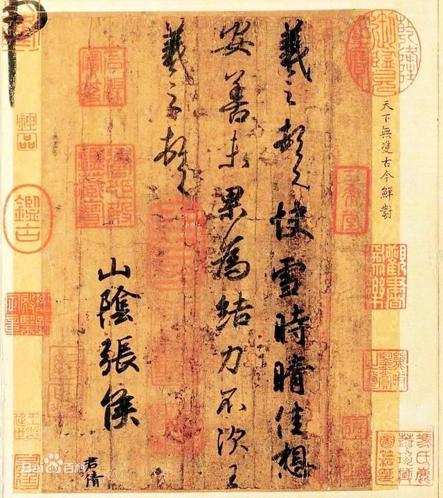
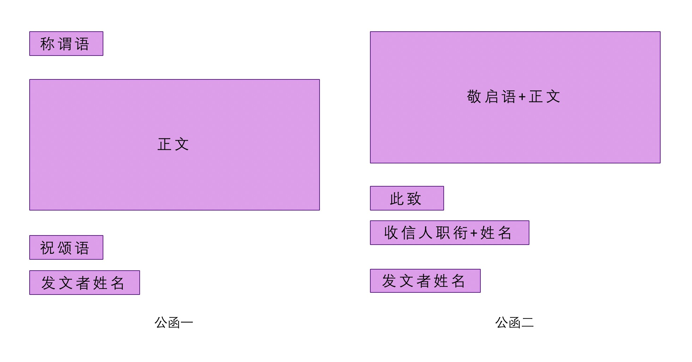
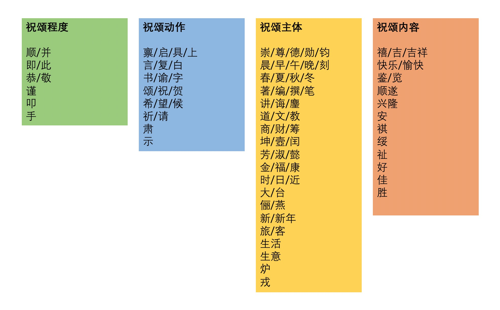

《论语·学而》讲到「有子曰：礼之用，和为贵。」，大意是说礼的运用贵在使人际关系和谐。如今我提倡善用敬语，其原因就在于此。我希望能通过敬语的推广减少如今社会的戾气，营造相互尊重相互关怀的社会风气。

<!--more-->

## 东西方邮件比照

在开始讲述我们的主题之前，先来看看我从网络上寻到的几份邮件/信件。

第一份是日文的，是一份公司内部部门名称变更的通知，[原文](https://business-mail.jp/example/753)如下：

```
営業部の皆様、お疲れ様です。
総務部の◎◎太郎です。

2011年6月1日（水）より、社内組織の名称を変更いたします。

■変更前：顧客管理部

■変更後：お客様相談センター

■変更実施日：2011年6月1日（水）9:00より

HP、会社案内、配布資料などについては、
5月30日（月）までに新しいものを各部署に配布いたします。
古い案内や資料は破棄しますので、各部署でまとめて、
管理部までお持ちください。

以上、よろしくお願いいたします。
```

拙译如下：

```
各位营业部同仁，辛苦您们了。
我是总务部的◎◎太郎。

2011 年 6 月 1 日（星期三）起，公司内部组织名称有所变更。

变更前：顾客管理部
变更后：客户咨询中心
变更实施日：2011 年 6 月 1 日（星期三）9:00 起

至于公司主页、介绍册和散发的资料等，5 月 30 日（星期一）前会发送新的到各职守。
旧的介绍册及资料要废弃了，请各职守汇总到管理部。

谨此，顺颂商祺。
```

第二份是英文的，是公司对外婉言谢绝合作的复信，[原文](http://www.blairenglish.com/exercises/emails/exercises/business-email-examples/business-email-examples.html)如下：
```
Dear Mr Boxall,

Thank you for your enquiry about supplying our company with new photocopying equipment.

Unfortunately, we are currently not in need of replacing our existing photocopiers. We recently entered a new 2 year contract with our existing photocopier provider.

You would be more than welcome to contact us again when our current contract is up for renewal.

Yours sincerely,


Jeff Thompson
Office Manager
```

草译如下：

```
尊敬的 Boxal 先生：

感谢您上次有关本公司新复印机采购的垂询。
不巧的是，我们当前没有替换现有复印机的需求。不过不久我们将与现有供应商签订新的为期两年的合同。
非常欢迎您在我们当前合同续订时再次来询。

敬复。


杰夫·汤普森
办公室主管
```

第三份是中文繁体的，是一份银行追讨用户欠款的通知，[原文](http://www.cuhk.edu.hk/ics/clrc/crcl_74/wong.pdf)如下（格式上依电子邮件特点略有改动）。

```
X 先生：

根據本行記錄，貴戶 X 月份信用咭賬項，至 X 月 X 日為止，尚未清繳信用咭使用條款規定的最低還款款額港幣 XXXX 元正。閣下如因私務繁忙，未有按時繳款，敬希於此信發出日期起 X 天內清繳上述欠款，以免妨礙本行繼續為閣下提供信用咭服務。
如有任何查詢，請致電 XXXXXXXX 與本行職員聯絡。閣下如已清繳上述欠款，請毋須理會此信。

XX 銀行謹啟。
XXXX 年 X 月 X 日
```

按大陆习惯转成简体字如下：

```
X 先生：

根据本行记录，贵户 X 月份信用卡账项，至 X 月 X 日为止，尚未清缴信用卡使用条款规定的最低还款款额港币 XXXX 元整。阁下如因私务繁忙，未有按时缴款，敬希于此信发出日期起 X 天内清缴上述欠款，以免妨碍本行继续为阁下提供信用卡服务。
如有任何查询，请致电 XXXXXXXX 与本行职员联络。阁下如已清缴上述欠款，请毋须理会此信。

XX 银行谨启。
XXXX 年 X 月 X 日
```

最后一份是东晋书法家王羲之写给友人的一封书信，后人称之为《快雪时晴帖》，为台北故宫博物院「三希」之首，[原帖](https://baike.baidu.com/item/%E5%BF%AB%E9%9B%AA%E6%97%B6%E6%99%B4%E5%B8%96/1247442)如下：



取其中一种断句如下：

```
羲之頓首/快雪時晴/佳/想安善/未果為結/力不次/王羲之頓首/山陰張侯
```

用白话文可以略译如下：

```
羲之顿首。下了一场雪，很舒爽，停得也是时候，很不错。想来你应该都平安健康。没能照心意把信写完，体力不继，表达难以得体，就此停笔。王羲之顿首。
```

（注：译文参考[*《為王羲之快雪時晴帖解碼 -- Mandulover 的部落格》*](http://blog.udn.com/Mandulover/5585178)。此外，「山阴张侯」应该是写在信封上的收件人，因此不写入书信内容）

## 中文电子邮件敬语分析

中文邮件分公函和私函两大类，公函结构简单不累赘，私函有应酬语体现书写者的情真意切。香港有个站点甚佳，叫 [*中小學中文實用寫作學習軟件（測試版）*](http://203.198.171.19/teaching/program/tongqingdayi/index.htm)，在[*書信*](http://203.198.171.19/teaching/program/tongqingdayi/letter/letter-format02a.htm) 栏目，可以看到有两种公函格式。这两种都是正式的写法，不过公函一应用较广。现根据电子邮件特点稍改格式如下：



这么改有什么案例可以支撑吗？有，请看下文。

第一封邮件是 Apple 发送的安全提醒：

```
◎◎，您好：

您的 Apple ID **@**.com 刚刚在一台以前未与此 Apple ID 相关联的电脑或设备上从 Mac App Store 下载了 QQ。如果您自上次购买后重设过您的密码，您可能也会收到此邮件。

如果是您本人启始了此项下载，请忽略此邮件。发送此邮件只是为了提醒您注意，以防此下载非您本人所为。

如果此下载不是由您启始的，我们建议你前往 iforgot.apple.com 更改您的密码，然后查看 Apple ID：安全性和 Apple ID获取更多帮助。

谨上
Apple
```
第二封是 Google 发送的账户验证：
```
尊敬的◎◎，您好！

我们收到了一项要求将 **@**.com 添加到您的 Google 帐户的请求。请点击下面的链接验证此请求。

https://accounts.google.com/VA?c=****=zh-CN

如果点击以上链接无法访问相关内容，请将该网址复制并粘贴至新的浏览器窗口中。

您不该收到这封电子邮件？
请忽略这封邮件，并且不要点击上方的链接。可能是有人输错了电子邮件地址，并无意中试图添加您的电子邮件地址。如果您没有点击上方的链接，您的电子邮件地址就不会被添加到其他帐户。

此致
Google 帐户小组敬上
```

第三封是七牛云的账户绑定安全提醒：

```
尊敬的◎◎：

您的账号 **@**.com 于 2017-04-03 17:24:26 成功绑定了 Github 账号 **@**.com (登录IP：*.*.*.*)。若非您本人操作，请尽快 解绑此账号 ，同时 修改您的密码 或 联系我们。

此致
七牛云团队
```

### 称谓语分析

### 敬启语分析

### 祝颂语分析



